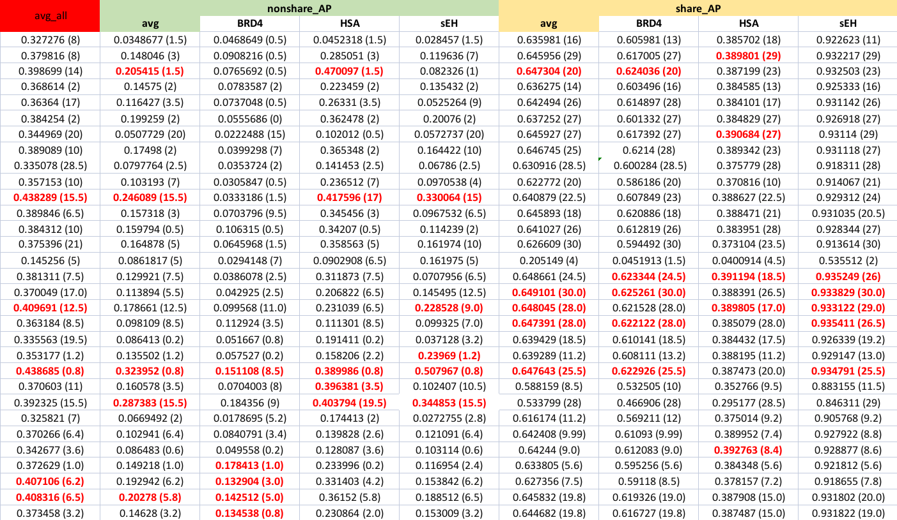
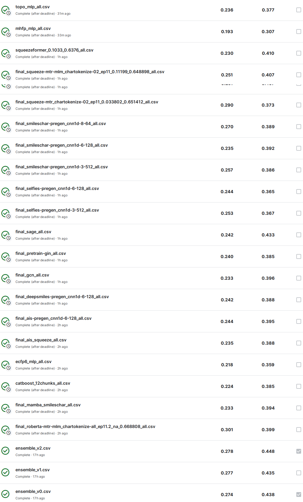

First, I would like to thank Kaggle and competition's host for another interesting challenge, which bring me headaches for a long time :D

Congrat to all participants, especially who actively discuss and provide many good insights/code in the forum. As usual on Kaggle, I have great time learning new things.

## First impression
- I trained an Embedding + MLP models on building block id only, e.g [BB1, BB2, BB3] = [100, 200, 300]. Yes, it just see the ID. This model scores shared_AP=65.5 on StratifiedKFold(n_splits=20), which indeed supass some of my SMILES+CNN1d without looking for what each building block looks like. This strongly indicate that model could memorized target binding and overfiting is nearby.
- Many attempts but actually I failed to setup a trustworthy CV scheme. In such situation, I decided to be blind at all and try to focus the fancy word "diversity": Multiple models, multiple input representations and SSL pretraining. I think that strategy indeed survived me in this shuffle competition.

## How to Cross-Validate?
As mentioned above, I don't know.

My split strategy for each fold:

    1. [11k samples] Hold out a number of building blocks for validation: 17 BB1 + 36 BB2 with positive-fraction-aware balance on each fold.
    2. [78k samples] Leave 20% molecules with most regular scaffolds (> 6116 mols/scaffold) for training, then do a Scaffold Split on the remaining 80% molecules
    3. [103k samples] Stratified Random split on the remaining
Total: 11k non-shared + 181k share, simulate the LB
This strategy create a little "harder" than pure random split on the shared part.

The hard part lie in 11k non-shared. Some observation on non-shared CV:
- CV scores vary largely between different folds. I find it hard to identify a trend/correlation, or which is work/not work
- Early stopping should help, but it also hard to answer WHEN? Usually best score is found in first 2 epochs, but also could be much longer

    *Each column in form: `score (best_epoch). All results belong to a single split`*,

- Suitable hyperparams also vary largely between folds. It looks like best setting with best score in fold A could give worst score on fold B, haha
- For one particular fold: score also change significantly due to just small change in hyperparams like random seed, validate interval, .etc. (13.5 -> 32.4, what?)
- Overfit a model on LB-nonshared-similar building blocks improve nonshared LB score. `Building block ECFP6 -> Tanimoto similarity -> Linear Assignment Matching` to select most similar/disimilar 170 BB1 + 360 BB2/3, then overfit a 1D-CNN on this subset. LB score for similar=8.8, disimilar=3.9. This indicate that we can improve LB by focusing more on these similar samples. I later select most similar 17 BB1 + 36 BB2/3 as validation set and try to improve CV on this split, but improved CV led to decrease in non-shared LB, which confused me

In conclusion, more and more experiments messed up my mind. The variation is too large and seem to be random for me. I gave up and focus on **SSL pretraining**, improve the diversity by using **multiple models** and **multiple input representations**, and allmost all models were **blindly train on all competition data with no cross-validation**, since I did not trust a single CV split alone and train on multiple CV splits seem to be too time-intensive

## SSL Pretraining
2 pretraining tasks:
- MLM (Masked Language Modeling) with standard setting: 15% masked tokens, 80%-10%-10% replaced with `[MASK]`/random tokens/keep unchanged.
- MTR (Multi-Task Regression): regress 189 pre-calculated RDKIT Descriptors. These target values are min-max normalized in contrast to CDF Transform in literature.

Pretraining using all data (both train + test), with larger sampling weights to test dataset to equalize the frequency of each building blocks and be "more familiar" with new domain test dataset.

I trained 3 models to be finetuned on competition task:
- Squeezeformer + MTR
- Squeezeformer + MTR + MLM
- Roberta + MTR + MLM
 

## Modeling

All models simultaneously predict 3 targets, include:
- Molecule Fingerprint + MLP
    + Fingerprints: ECFP6, Topological Torsion, MHFP
    + MLP with hidden channels [1024, 1024], dropout = 0.3
    + Tried KAN but did not outperform MLP
    + [Independent Feature Matching (IFM)](https://openreview.net/forum?id=NLFqlDeuzt) gave no boost
    + Feature Selection based on SHAP also gave no boost. For a long time I had believe Feature Selection is the key to reduce share-nonshare gap and overfitting caused by noisy signal, but had no success with it.

- String-based 1D-CNN
    + Input representations: SMILES, Atom-In-Smiles (AIS), SELFIES, DeepSMILES
    + Model: Improved from the [awesome public notebook](https://www.kaggle.com/code/ahmedelfazouan/belka-1dcnn-starter-with-all-data), just add MaskedBatchNorm, MaskedAttentionPooling and scale to larger size (depth = 6, dim=128)
    + All input representations give equally good result on shared part. SELFIES give slightly worse results on non-shared and converge slower than other input representations
    + Deeper -> better generalisation. `(depth=8, dim=64)` is `>` `(depth=3, dim=512)` on non-shared, but `<` on shared. `(depth=3, dim=512)` also better remember the training set (higher train AP) while archive similar share AP. This need more experiments to confirm.

- String-based Hybrid CNN-Transformer
    + Input representation: SMILES, Atom-In-Smiles
    + Model: Squeezeformer, depth = 6, dim=64/96/128
    + No positional encoding, CNN do the job. ROPE decrease CV score
    + Pretrain: `No pretrain` or `MTR` or `MLM+MTR`

- String-based Transformer
    + Input representation: SMILES
    + Model: Roberta, depth=6, dim=256, Absolute PE
    + Pretrain: `MLM+MTR`

- String-based MAMBA
    + Input representation: SMILES
    + Model: Mamba, depth=8, dim=128
- GNN
    + GIN with depth=5, dim=300, finetune from public pretrained [Mole-BERT](https://github.com/junxia97/Mole-BERT) (pretrained on ZINC)
    + GCN/GraphSAGE with depth=5, dim=128
- Catboost
    + Ensemble of 12 folds, covering all train dataset. Each fold contain all positive samples and 5.0 times of negative samples.
    + Max_depth=10, lr=0.2, iterations=4000, bootstrap_type='No'

Some modeling results used in final ensemble, I think analyze share/nonshared/new library scores is needed for further analysis, and I will update that results later.

Simple weighted ensemble with heuristic weights scores PB=27.8 and LB=44.8
Indeed there are some single model with higher PB scores, but ensemble reduce variance and give more stable/trustworthy results. This result is luckily enough for a gold medal.

## Code
- Training code: https://github.com/dangnh0611/kaggle_leash_belka (updated soon)

Thanks for your attention !